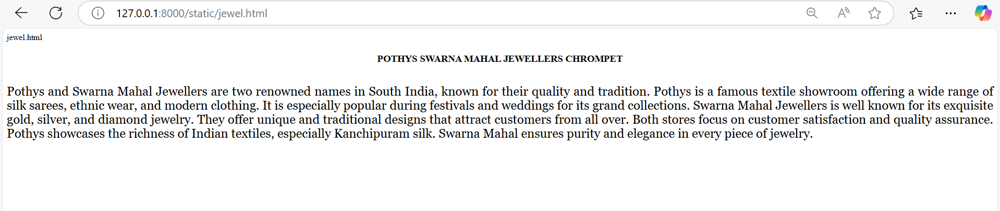
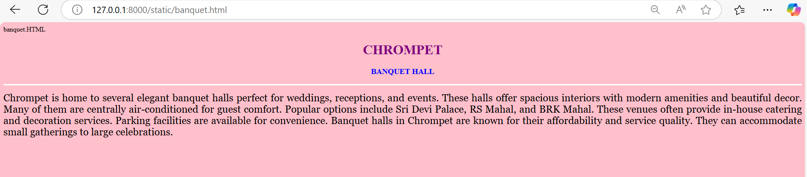
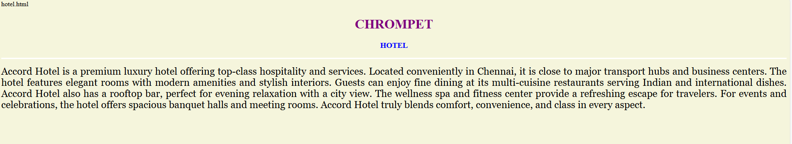
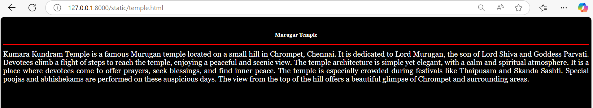

# Ex04 Places Around Me
## Date: 22.04.2025

## AIM
To develop a website to display details about the places around my house.

## DESIGN STEPS

### STEP 1
Create a Django admin interface.

### STEP 2
Download your city map from Google.

### STEP 3
Using ```<map>``` tag name the map.

### STEP 4
Create clickable regions in the image using ```<area>``` tag.

### STEP 5
Write HTML programs for all the regions identified.

### STEP 6
Execute the programs and publish them.

## CODE
```
<html>
<head>
    <title>My City - Chrompet</title>
</head>
<body>
    <h1 align="center">
        <font color="red"><b>CHROMPET</b></font>
    </h1>
    <h3 align="center">
        <font color="blue"><b>NITHYASREE S (24900149)</b></font>
    </h3>
    <center>
        <!-- Image Map Generated by http://www.image-map.net/ -->

<map name="image-map">

    <area target="" alt="Temple" title="Temple" href="temple.html" coords="626,500,115" shape="circle">
    <area target="" alt="Banquet Hall" title="Banquet Hall" href="banquet.html" coords="1544,241,138" shape="circle">
    <area target="" alt="Hotel" title="Hotel" href="hotel.html" coords="473,132,107" shape="circle">
    <area target="" alt="Jewellers" title="Jewellers" href="jewel.html" coords="739,61,71" shape="circle">
    <area target="" alt="Lake" title="Lake" href="lake.html" coords="1415,628,102" shape="circle">
</map>
    </center>
</body>
</html>


lake.html
<html>
<head>
<title>My Home Town</title>
</head>
<body bgcolor="skyblue">
<h1 align="center">
<font color="purple"><b>CHROMPET</b></font>
</h1>
<h3 align="center">
<font color="blue"><b>LAKE</b></font>
</h3>
<hr size="3" color="white">
<p align="justify">
<font face="Georgia" size="5">
    Nanmangalam Lake is a small but significant water body located near Chrompet in Chennai, Tamil Nadu.
    It plays a crucial role in recharging groundwater and supporting the local ecosystem.
    The lake is surrounded by residential areas and faces pressure due to rapid urbanization.
    Despite this, it continues to be a vital source of water during dry seasons.
    Nanmangalam Lake is also close to the Nanmangalam Reserve Forest, which adds to the area's ecological importance.
    In recent years, local communities and environmental groups have taken steps to protect and restore the lake.
    Rainwater collected in the lake helps improve the water table.
    
</p>
</body>
</html>

jewel.html

<html>
<head>
<title>My Home Town</title>
</head>
<body bgcolor="white">
<h1 align="center">
<font color="cyan"><b></b></font>
</h1>
<h3 align="center">
<font color="black"><b>POTHYS SWARNA MAHAL JEWELLERS CHROMPET</b></font>
</h3>
<hr size="3" color="white">
<p align="justify">
<font face="Georgia" size="5">
    Pothys and Swarna Mahal Jewellers are two renowned names in South India, known for their quality and tradition.
    Pothys is a famous textile showroom offering a wide range of silk sarees, ethnic wear, and modern clothing.
    It is especially popular during festivals and weddings for its grand collections.
    Swarna Mahal Jewellers is well known for its exquisite gold, silver, and diamond jewelry.
    They offer unique and traditional designs that attract customers from all over.
    Both stores focus on customer satisfaction and quality assurance.
    Pothys showcases the richness of Indian textiles, especially Kanchipuram silk.
    Swarna Mahal ensures purity and elegance in every piece of jewelry.
    
</p>
</body>
</html>

banquet.HTML

<html>
<head>
<title>My Home Town</title>
</head>
<body bgcolor="pink">
<h1 align="center">
<font color="purple"><b>CHROMPET</b></font>
</h1>
<h3 align="center">
<font color="blue"><b>BANQUET HALL</b></font>
</h3>
<hr size="3" color="white">
<p align="justify">
<font face="Georgia" size="5">
    Chrompet is home to several elegant banquet halls perfect for weddings, receptions, and events. 
    These halls offer spacious interiors with modern amenities and beautiful decor.
    Many of them are centrally air-conditioned for guest comfort.
    Popular options include Sri Devi Palace, RS Mahal, and BRK Mahal.
    These venues often provide in-house catering and decoration services.
    Parking facilities are available for convenience.
    Banquet halls in Chrompet are known for their affordability and service quality.
    They can accommodate small gatherings to large celebrations.
   </p>
</body>
</html>

hotel.html

<html>
<head>
<title>My Home Town</title>
</head>
<body bgcolor="beige">
<h1 align="center">
<font color="purple"><b>CHROMPET</b></font>
</h1>
<h3 align="center">
<font color="blue"><b>HOTEL</b></font>
</h3>
<hr size="3" color="white">
<p align="justify">
<font face="Georgia" size="5">
    Accord Hotel is a premium luxury hotel offering top-class hospitality and services.
Located conveniently in Chennai, it is close to major transport hubs and business centers.
The hotel features elegant rooms with modern amenities and stylish interiors.
Guests can enjoy fine dining at its multi-cuisine restaurants serving Indian and international dishes.
Accord Hotel also has a rooftop bar, perfect for evening relaxation with a city view.
The wellness spa and fitness center provide a refreshing escape for travelers.
For events and celebrations, the hotel offers spacious banquet halls and meeting rooms.
Accord Hotel truly blends comfort, convenience, and class in every aspect.</p>
</body>
</html>

temple.html

<html>
<head>
<title>My Home Town</title>
</head>
<body bgcolor="black">
<h1 align="center">
<font color="white"><b></b></font>
</h1>
<h3 align="center">
<font color="white"><b>Murugar Temple</b></font>
</h3>
<hr size="3" color="red">
<p align="justify">
<font face="Georgia" size="5 " font color="white">
    Kumara Kundram Temple is a famous Murugan temple located on a small hill in Chrompet, Chennai.
It is dedicated to Lord Murugan, the son of Lord Shiva and Goddess Parvati.
Devotees climb a flight of steps to reach the temple, enjoying a peaceful and scenic view.
The temple architecture is simple yet elegant, with a calm and spiritual atmosphere.
It is a place where devotees come to offer prayers, seek blessings, and find inner peace.
The temple is especially crowded during festivals like Thaipusam and Skanda Sashti.
Special poojas and abhishekams are performed on these auspicious days.
The view from the top of the hill offers a beautiful glimpse of Chrompet and surrounding areas.
</p>
</body>
</html>
```

## OUTPUT








## RESULT
The program for implementing image maps using HTML is executed successfully.
